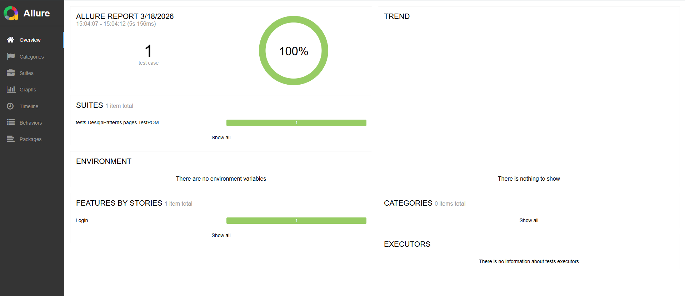

# Web Automation Practice
This project demonstrates a professional automated testing suite for a web login flow, focusing on **code reusability**, **clean architecture**, and **automated assertions**.

## Technologies Used
* **Java** (JDK 17+)
* **Selenium WebDriver** (Browser automation)
* **JUnit 5** (Test framework and Lifecycle hooks)
* **Maven** (Dependency management)
* **RestAssured** (Test and validation)

## Project 1: Web Login (Heroku Login) - Features & Technical Highlights
* **Automated E2E Flow**: Covers both positive (successful login) and negative (invalid credentials) scenarios.
* **Test Lifecycle Management**: Uses `@BeforeEach` and `@AfterEach` hooks to manage browser sessions efficiently, ensuring test independence.
* **Refactored for Reusability**: Implemented Helper Methods (`enterUser`, `clickLoginButton`, etc.) to reduce code duplication and follow **DRY (Don't Repeat Yourself)** principles.
* **Dynamic Assertions**: Automated validation of success and error messages using JUnit Assertions.

## Project 2: E-Commerce End-to-End Flow (SauceDemo)
* **Full Checkout Cycle**: Automated the entire journey from login to "Thank You" confirmation page.
* **Dynamic Data Handling**: Implemented List<WebElement> and for-each loops to interact with a dynamic product catalog, ensuring tests remain robust even if product order changes.
* **Advanced Browser Configuration**: Utilized ChromeOptions and HashMap to disable browser-level alerts (leak detection, password saving) that can obstruct automation.
* **Defensive Programming**: Added logic to verify cart contents and presence of elements before interaction to prevent "flaky" tests.

## Project 3: API Test (JSONPlaceholder)
* **API Automation**: Implemented CRUD testing using **RestAssured**.
* **Data Serialization**: Integrated **Jackson Databind** to automatically convert Java Maps into JSON payloads.
* **Validation**: Applied BDD (Given/When/Then) structure to validate HTTP status codes and response bodies.

## Project 4: Complex Elements (Heroku Dropdown menus; JavaScript Alerts; iFrames)
* **Complex Elements**: Mastery of non-standard web components like **iFrames** (nested navigation), **JavaScript Alerts** (system pop-ups), and **Dropdowns** using the Selenium `Select` class.
* **Context Switching**: Demonstrated ability to manage WebDriver focus between different DOM layers and system alerts.

## Project 5: Advanced API Integration & Security
* **Dynamic Token Management**: Automated the extraction of Bearer Tokens/Cookies from login responses to authorize subsequent restricted requests (DELETE/PUT).
* **Data Resilience**: Implemented dynamic ID retrieval using **JsonPath**, ensuring tests remain stable by discovering available resources in real-time instead of relying on hardcoded values.
* **Object Mapping**: Leveraged **Jackson Databind** for seamless Java-to-JSON serialization, maintaining clean and maintainable test data structures.

## Project 6 - Part 1: Design Patterns - Page Object Model (POM) & Fluent Interface
* **Decoupling**: Implemented **POM** to separate test scripts from UI locators, significantly reducing maintenance effort.
* **Fluent Design**: Applied **Method Chaining** to create a Domain Specific Language (DSL) within the framework, making tests more intuitive and readable.
* **Context Switching**: Automated the transition between page objects (e.g., LoginPage to InventoryPage) via return types, ensuring a seamless test flow.

## Project 6 - Part 2: Synchronization & Resilience (WebDriverWait)
* **Explicit Waits**: Replaced brittle `Thread.sleep` with WebDriverWait, implementing intelligent synchronization based on element states (visibility, clickability, presence).
* **Dynamic Content Handling**: Developed logic to interact with dynamic lists using **ExpectedConditions**, allowing the framework to wait for the DOM to be fully populated before execution.
* **Separation of Concerns**: Maintained strict architectural boundaries by keeping element synchronization within Page Objects while keeping validation logic (Assertions) in the Test layer.

## Project 6 - Part 3: Data-Driven Testing (DDT)
* **Massive Test Coverage**: Implemented **Data-Driven Testing** using JUnit 5 `@ParameterizedTest`, enabling the execution of multiple test scenarios (Standard, Locked-out, and Problem users) through a single test method.
* **Separation of Concerns (Happy vs. Sad Path)**: Architected distinct test suites for successful flows and error validation, ensuring precise assertions and clearer reporting.
* **Advanced Parsing**: Utilized custom CSV delimiters and quoting to handle complex string validation, such as multi-sentence error messages from the UI.

## Project 6 - Part 4: Professional Reporting (Allure Report)
* **Interactive Dashboards**: Integrated **Allure Report** to transform raw JUnit results into a high-level executive dashboard, featuring success rate charts and execution timelines.
* **Test Categorization**: Utilized Allure annotations (`@Feature`, `@Story`, `@Severity`) to organize tests by business functionality and impact, facilitating quick triage of failures.
* **Traceability**: Each test execution includes detailed steps and metadata, providing full visibility into the automation lifecycle for both technical and non-technical stakeholders.
* **Visual Insight**:

# Version Française
Ce projet présente une suite de tests automatisés professionnels pour un flux de connexion web, en mettant l'accent sur la **réutilisabilité du code**, l'**architecture propre** et les **assertions automatisées**.

## Technologies Utilisées
* **Java** (JDK 17+)
* **Selenium WebDriver** (Automation du navigateur)
* **JUnit 5** (Cadre de test et hooks de cycle de vie)
* **Maven** (Gestion das dépendances)
* **RestAssured** (Test et validation)

## Projet 1 : Connexion Web (Heroku Login) - Points Saillants Techniques
* **Flux E2E Automatisé :** Couvre les scénarios positifs (connexion réussie) et négatifs (identifiants invalides).
* **Gestion du Cycle de Vie :** Utilisation des annotations `@BeforeEach` et `@AfterEach` pour gérer les sessions de navigation de manière isolée.
* **Refactorisation pour la Réutilisabilité :** Implémentation de méthodes auxiliaires (`enterUser`, `clickLoginButton`, etc.) suivant les principes **DRY (Don't Repeat Yourself)**.

## Projet 2 : Flux E2E de Commerce Électronique (SauceDemo)
* **Cycle d'achat complet** : Automatisation du parcours complet, de la connexion à la page de confirmation de commande.
* **Gestion dynamique des données** : Utilisation de List<WebElement> et de boucles for-each pour interagir avec un catalogue de produits dynamique.
* **Configuration avancée du navigateur** : Utilisation de ChromeOptions pour désactiver les alertes de sécurité du navigateur qui pourraient bloquer l'automatisation.
* **Assertions robustes** : Validation de la correspondance entre les articles sélectionnés et les articles présents dans le panier.

## Projet 3: Test API (JSONPlaceholder)
* **Automatisation d'API** : Mise en œuvre de tests CRUD avec **RestAssured**.
* **Sérialisation** : Utilisation de **Jackson** pour la conversion automatique des données Java en JSON.
* **Validation**: Structure BDD pour valider les codes d'état et le contenu des réponses.

## Projet 4: Éléments Complexes (Heroku Dropdown menus; JavaScript Alerts; iFrames)
* **Éléments Complexes** : Maîtrise des composants web avancés tels que les **iFrames** (navigation imbriquée), les alertes **JavaScript** et les menus **Dropdown**.
* **Changement de Contexte** : Capacité démontrée à gérer le focus du WebDriver entre les différentes couches du DOM.

## Projet 5: Intégration API Avancée et Sécurité
* **Gestion Dynamique des Tokens** : Automatisation de l'extraction des jetons (Tokens/Cookies) à partir des réponses de connexion pour autoriser les requêtes restreintes ultérieures.
* **Résilience des Données** : Implémentation de la récupération dynamique d'identifiants (IDs) via **JsonPath**, garantissant la stabilité des tests en découvrant les ressources disponibles en temps réel.
* **Sérialisation des Objets** : Utilisation de **Jackson Databind** pour une conversion fluide entre Java et JSON, assurant des structures de données de test propres et évolutives.

## Projet 6 - Partie 1 : Modèle d'Objet de Page (POM) et Interface Fluide
* **Découplage** : Implémentation du **POM** pour séparer les scripts de test des localisateurs d'interface (UI), réduisant considérablement l'effort de maintenance.
* **Conception Fluide** : Application du **Method Chaining** pour créer un langage spécifique au domaine (DSL) au sein du framework, rendant les tests plus intuitifs et lisíveis.
* **Changement de Contexte** : Automatisation de la transition entre les objets de page (ex: de LoginPage à InventoryPage) via les types de retour, assurant un flux de test fluide.

## Projet 6 - Partie 2 : Synchronisation et résilience (WebDriverWait)
* **Attentes Explicites** : Remplacement des `Thread.sleep` fragiles par WebDriverWait, implémentant une synchronisation intelligente basée sur l'état des éléments (visibilité, cliquabilité, présence).
* **Gestion du Contenu Dynamique** : Développement d'une logique pour interagir com des listes dynamiques via **ExpectedConditions**, permettant au framework d'attendre que le DOM soit complètement chargé avant l'exécution.
* **Séparation des Responsabilités** : Maintien de frontières architecturales strictes en gardant la synchronisation des éléments dans les Page Objects, tout en conservant la logique de validation (Assertions) dans la couche de Test.

## Projet 6 - Partie 3 : Data-Driven Testing (DDT)
* **Couverture de Tests Massive** : Implémentation de **Tests Pilotés par les Données** (DDT) avec JUnit 5 `@ParameterizedTest`, permettant l'exécution de multiples scénarios (utilisateurs standards, bloqués ou problématiques) via une seule méthode de test.
* **Séparation des Flux (Succès vs Échec)** : Architecture de suites de tests distinctes pour les flux réussis et la validation des erreurs, garantissant des assertions précises et des rapports plus clairs.
* **Analyse Avancée (Parsing)** : Utilisation de délimiteurs CSV personnalisés pour gérer la validation de chaînes complexes, telles que les messages d'erreur multi-phrases de l'interface utilisateur.

## Projet 6 - Partie 4 : Rapports Professionnels (Allure Report)
* **Tableaux de Bord Interactifs** : Intégration d'**Allure Report** pour transformer les résultats JUnit bruts en un tableau de bord exécutif, comprenant des graphiques de taux de réussite et des chronologies d'exécution.
* **Catégorisation des Tests** : Utilisation des annotations Allure (`@Feature`, `@Story`, `@Severity`) pour organiser les tests par fonctionnalité métier et par impact, facilitant le triage rapide des échecs.
* **Traçabilité** : Chaque exécution de test inclut des étapes détaillées et des métadonnées, offrant une visibilité complète sur le cycle de vie de l'automatisation pour les parties prenantes techniques et non techniques.
* **Aperçu Visuel** : 

